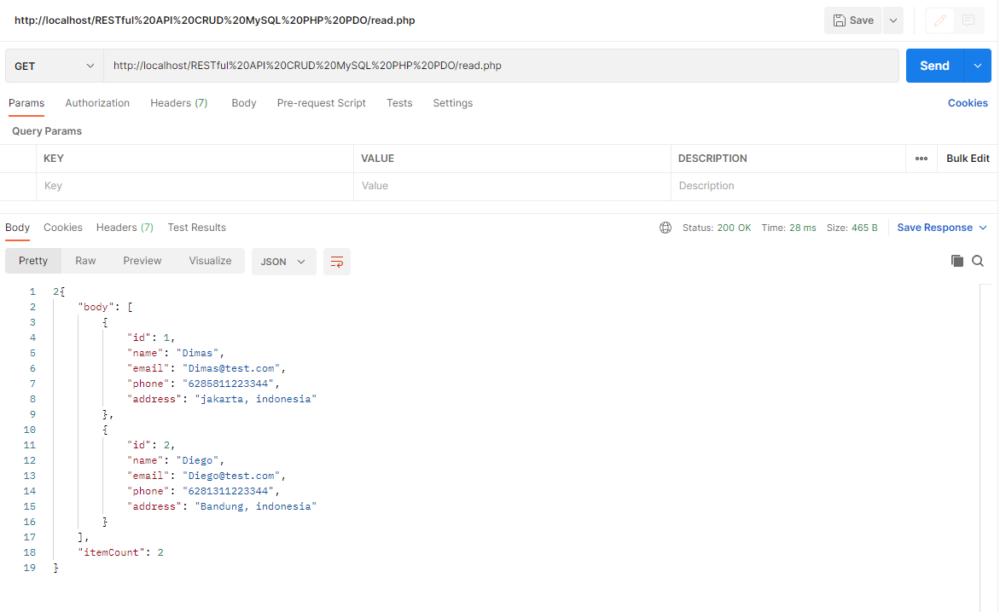

#  RESTful API - CRUD Data using MYSQL PHP PDO
# URL
```yaml
http://localhost/RESTful API CRUD MySQL PHP PDO/read.php
http://localhost/RESTful API CRUD MySQL PHP PDO/single_read.php/?id=2
http://localhost/RESTful API CRUD MySQL PHP PDO/create.php
http://localhost/RESTful API CRUD MySQL PHP PDO/update.php
http://localhost/RESTful API CRUD MySQL PHP PDO/delete.php
```
## SQL


# GET -> Read Data


# GET -> Single Read Data


# POST -> Create Data


# POST -> Update Data


# DELETE

